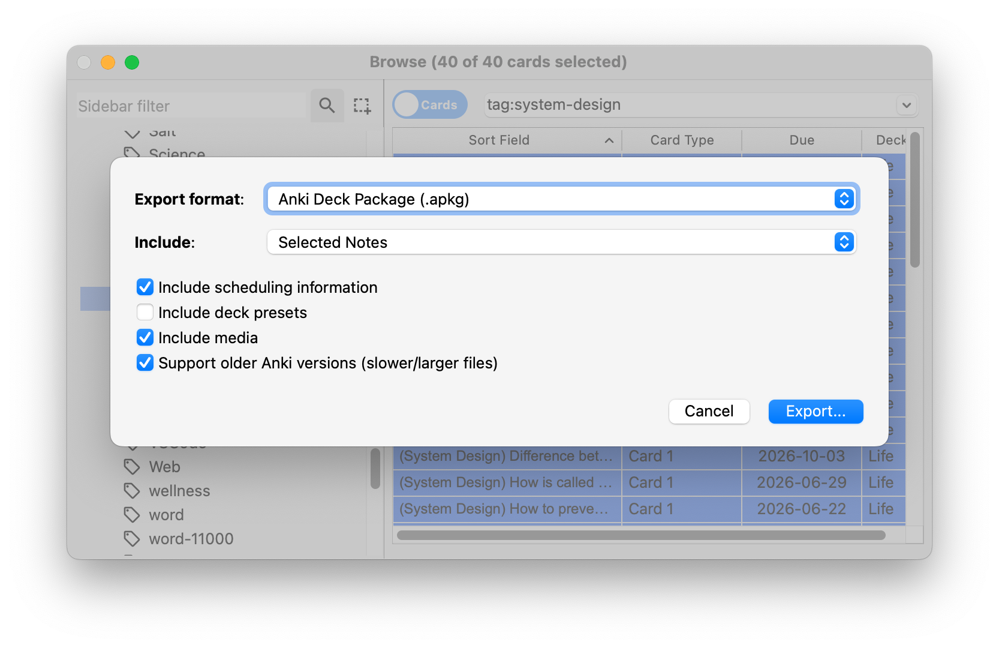

# nt-anki

`nt-anki` is a CLI tool for importing Anki flashcards into _The NoteWriter_ repository.

## Features

- Converts only Anki `.apkg` collections to Markdown notes (`.colpkg` files will not be supported).
- Copies media files referenced in Anki cards.
- Creates a packfile containing review operations for imported flashcards.

## Usage

```bash
nt-anki import <anki.apkg> <markdown.md> [--media-dir DIR] [--ignore-scheduling]
```

### Options

- `--media-dir DIR`
  Specify a subdirectory for media files (images, audio) referenced in Anki cards.

- `--ignore-scheduling`
  If set, skips creation of packfiles for reviews and only outputs Markdown and media.

### Example

```bash
nt-anki import english.apkg skills/english.md --media-dir medias
```

## Workflow

1. Export a Anki deck (from main screen) or a subset of your notes (from browser screen).



2. Run `nt-anki --ignore-scheduling` to check the generated Markdown first.
3. Reset the changes using `git restore`
4. Rerun `nt-anki` to save reviews and generate the packfile.
5. Edit the Markdown files to define flashcard titles.
6. Run:
   ```
   $ nt add path/to/markdown.md
   $ nt import-pack path/to/generated/packfile.pack
   $ nt commit # Optional
   ```

