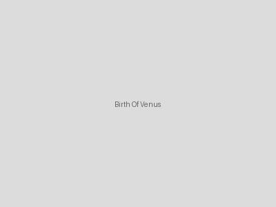

# Paintings

## Artwork: The Starry Night

`@artist: Vincent van Gogh`
`@year: 1889`
`@museum: Museum of Modern Art, New York`

A swirling night sky over a small French village, considered one of van Gogh's masterpieces. The painting depicts the view from his asylum room window at Saint-Rémy-de-Provence.

## Artwork: The Great Wave off Kanagawa

`@artist: Katsushika Hokusai`
`@year: 1831`
`@museum: Various collections worldwide`

An iconic woodblock print depicting a powerful wave threatening boats near Mount Fuji. Part of the series "Thirty-six Views of Mount Fuji."

## Artwork: Girl with a Pearl Earring

`@artist: Johannes Vermeer`
`@year: 1665`
`@museum: Mauritshuis, The Hague`

Often called the "Mona Lisa of the North," this portrait captures a girl wearing an exotic dress and a large pearl earring, looking over her shoulder at the viewer.

## Artwork: The Birth of Venus

`@artist: Sandro Botticelli`
`@year: 1486`
`@museum: Uffizi Gallery, Florence`

A masterpiece of the Italian Renaissance depicting the goddess Venus emerging from the sea as a fully grown woman, arriving at the shore after her birth.

## Artwork: The Scream

`@artist: Edvard Munch`
`@year: 1893`
`@museum: National Museum of Norway`

An expressionist painting showing a figure with an agonized expression against a tumultuous orange sky. One of the most recognizable images in art history.

## Artwork: American Gothic

`@artist: Grant Wood`
`@year: 1930`
`@museum: Art Institute of Chicago`

A painting depicting a farmer standing beside his daughter in front of their house, symbolizing American rural life and values.

## Artwork: Water Lilies

`@artist: Claude Monet`
`@year: 1919`
`@museum: Various collections worldwide`

Part of Monet's famous series of approximately 250 oil paintings depicting his flower garden at Giverny, showcasing his impressionist style.

## Artwork: The Persistence of Memory

`@artist: Salvador Dalí`
`@year: 1931`
`@museum: Museum of Modern Art, New York`

A surrealist masterpiece featuring melting pocket watches in a dreamlike landscape, exploring themes of time and memory.

## Artwork: Guernica

`@artist: Pablo Picasso`
`@year: 1937`
`@museum: Museo Reina Sofía, Madrid`

A powerful anti-war painting created in response to the bombing of Guernica during the Spanish Civil War, showing the tragedies and suffering of war.

## Artwork: The Kiss

`@artist: Gustav Klimt`
`@year: 1908`
`@museum: Österreichische Galerie Belvedere, Vienna`

A symbolist painting showing a couple embracing, their bodies entwined in elaborate robes decorated with gold leaf and symbolic ornamentation.
