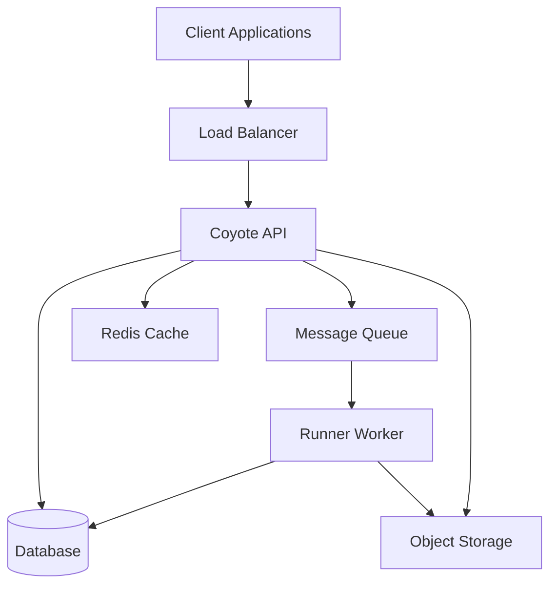

# Product

## Note: Presentation

The Acme Platform is a comprehensive cloud-based solution designed to streamline business operations and enhance productivity. Built on modern microservices architecture, the platform consists of two main components: Coyote API and Runner Worker.

The Coyote API serves as the central hub for all client interactions, providing a robust RESTful interface for data management, authentication, and business logic. It handles real-time requests from web and mobile applications, ensuring low-latency responses and high availability.

The Runner Worker operates in the background, processing asynchronous tasks such as data synchronization, report generation, email notifications, and scheduled maintenance. This separation of concerns allows the platform to scale efficiently and maintain optimal performance even under heavy load.

Together, these components deliver a seamless experience for enterprise customers, supporting thousands of concurrent users while maintaining 99.9% uptime.

## Reference: Architecture

## Flashcard: Platform Components

What are the **two main components** of the Acme Platform?

---

Coyote API and Runner Worker

## Flashcard: Coyote API Purpose

What is the **purpose** of the Coyote API?

---

Serves as the central hub for client interactions, providing a RESTful interface for data management, authentication, and business logic

## Flashcard: Runner Worker Tasks

What does the **Runner Worker** handle?

---

Processes asynchronous tasks such as data synchronization, report generation, email notifications, and scheduled maintenance

## Flashcard: Platform Uptime

What **uptime** does the Acme Platform maintain?

---

99.9% uptime

## Flashcard: Architecture Pattern

What **architecture pattern** does the Acme Platform use?

---

Microservices architecture
