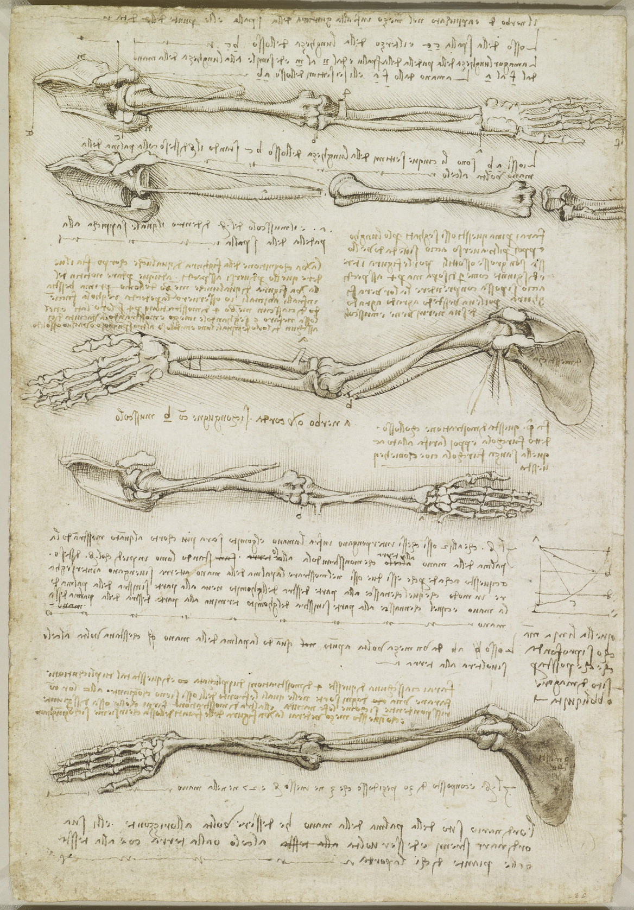

# Basic Note-Taking

## Note: A Note

Notes has many uses:

* Journaling
* To-Do list
* Drawing
* Diary
* Flashcard
* Reminder

## Quote: Tim Ferris on Note-Taking

`@author: Tim Ferris`

I take notes like some people take drugs...

## Flashcard: Commonplace Book

(Thinking) What are **commonplace books**?

---

A tool to compile knowledge, usually by writing information into books.

## Reference: Leonardo da Vinci's Notebooks

`@author: Leonardo da Vinci`
`@year: ~1510`

