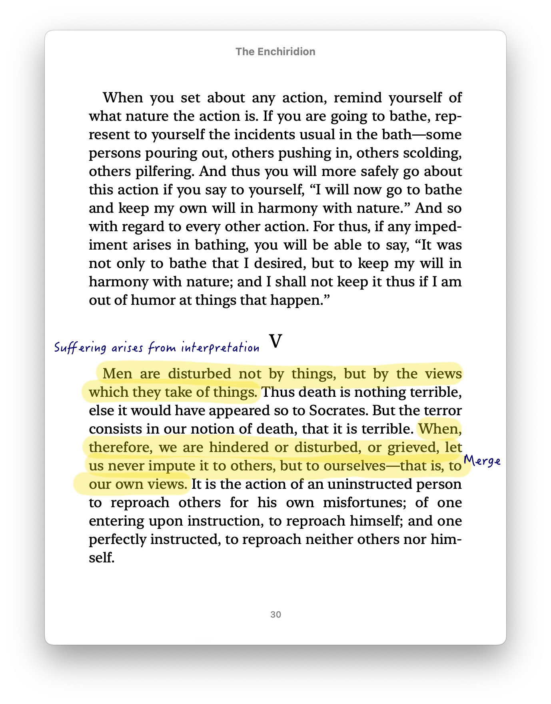
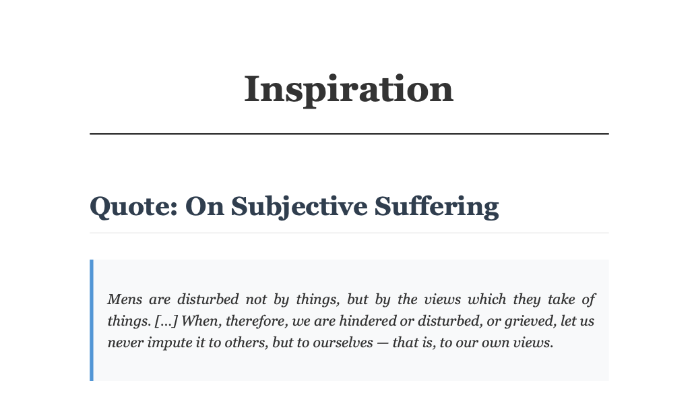

## Note Collecting

_The NoteWriter_ is not designed to collect your volatile notes, only to store and use your permanent notes as much as possible.

There are many options to collect your notes while reading. You can master the art of marginalia and annotate your physical books in the margins. You can use an e-reader with an electronic pen and export your notes in a digital file. You can use your phone to take your notes.

You only have to collect some notes about what resonates.

## Second-Brain / Zettelkasten

Organizing your reading notes is not trivial (except if you just want to store them and never use them again). Different systems have been designed. You may have heard about Zettelkasten, commonplace books or the second brain before.

**Commonplace Books, Zettelkasten, and Second Brain have similar goals and principles**. All capture notes outside your head. Notes are added incrementally and are meant to be revisited. Notes are written for yourself, based on your interests and long-term goals.

Differences exist between these systems:

* _Commonplace Book_ (Since thousands of years) = "What do I want to remember?"
  * Preserve and **revisit what resonates**. Collect quotes, your observations and try to group them by theme and use an index.
* _Zettelkasten_ (Since a century) = "What does this idea connect to?"
  * Knowledge grows through **dialogue between ideas** and links between atomic notes (one idea per note) is essential. Structure emerges from these links. Using your own words is also encouraged.
* _Second Brain_ (Since a decade) = "How will I use this?"
  * Knowledge exists to **support action**. Notes are often tied to outcomes and the focus on completing projects. A digital tool is required.

_The NoteWriter_ can accommodate any of these systems:

* Use different Markdown files for different topics to build your commonplace book.
* Use Markdown links or Wikilinks to link atomic notes to build your Zettelkasten.
* Use directories for projects/areas/resources (**PAR**A) (the last A for archival is not required when using Git) to build your Second Brain

In practice, you will often use an hybrid approach using project folders, links between atomic notes written in your own words, and keep notes filled with quotations.

## Importing Reading Notes

Importing your reading notes is trivial. You just have to convert them to Markdown. Optionally (but recommended), you can also:

- Enrich them with metadata (tags, attributes) to find them later.
- Annotate them to explain what resonates.
- Create a new note using your own words elsewhere in your repository.

Ex:



The previous note could be converted like this:

```md resources/books/enchiridion.md
---
title: "The Enchiridion"
original_title: "Ἐγχειρίδιον"
author: "Epictetus"
tags: [philosophy]
---

# The Enchiridion

## Quote: On Subjective Suffering

`@references: [[meditations#Quote: Happiness Depends on Quality of Your Thoughts]]`
`#thinking`

Mens are disturbed not by things, but by the views which they take of things. [...]
When, therefore, we are hindered or disturbed, or grieved,
let us never impute it to others, but to ourselves -- that is, to our own views.

> ✍️ Suffering arises from interpretation.
```

The original text has been copied into a new Markdown file to group all notes about this book. Common attributes are defined using the YAML front matter. A specific tag `#thinking` has been set on this note of type `Quote` and a link to another quote has been added using the attribute `@references`.

:::tip

**Importing notes** = Copy/Paste + Enrich with **Metadata** + Add **link(s)** + **Annotate**

:::


## Commonplace Book

_The NoteWriter_ supports an additional command `nt-book` to generate books from your notes (ePUB or PDF).

_Example_: Generate a commonplace book with all your favorite quotes

1. Declare your book in `config.jsonnet`

```jsonnet
{
    books: [
        {
            title: "My Commonplace Book",
            author: ["Julien Sobczak"],
            language: "en-US",
            toc: true,                    // Generate table of contents
            format: ["epub", "pdf"],      // Output formats
            chapters: [
                {
                    title: "Introduction",
                    text: "This book contains the most inspiring quotes I discovered during my learning journey.",
                },
                {
                    title: "Inspiration",
                    query: "type:Quote #favorite",
                    pageBreaks: true, # One quote per page
                    includeComments: false, # Exclude annotations
                },
            ]
        }
    ]
}
```

2. Run the `nt-book` command:

```shell
$ nt-book generate "My Commonplace Book"
# ePub and PDF files have been generated
```




## Next...

Your reading notes are the building blocks for other use-cases:

* You will sometimes create [flashcards from your reading notes](./learning) to remember more of what you read.
* You will use your notes as materials when [writing](./writing) a new blog post or any other [creative endeavour](./creating).
