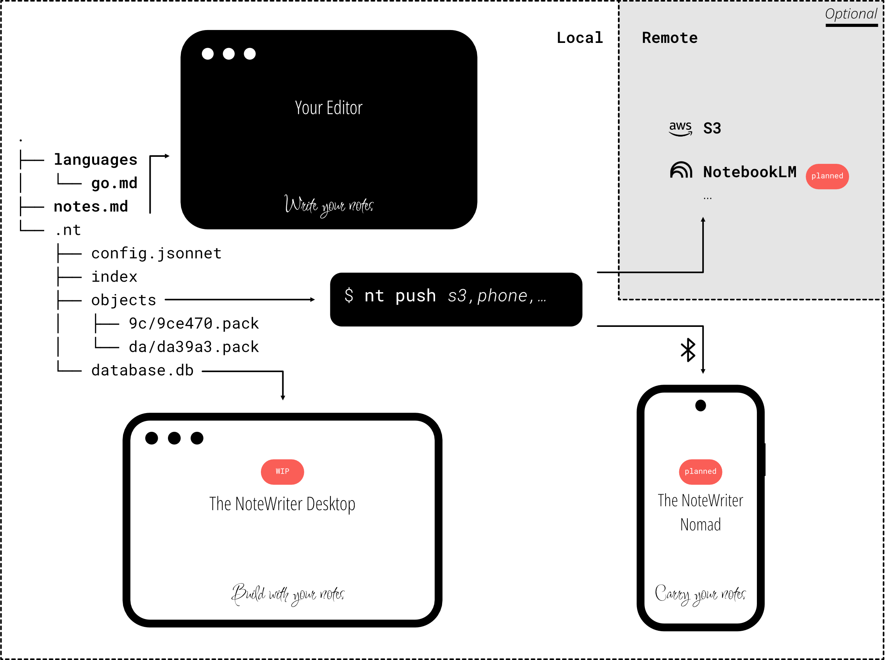

:::caution

Remotes play an important role in the design of _The NoteWriter_. The current implementation only supports pushing the notes to an object storage bucket, which is convenient to backup the operations on your notes like flashcard study sessions.

The long-term goal is to use remote to provide a local-first solution by pushing your notes to a phone with a Bluetooth/Wifi connection. Other remotes are also planned to push a subset of notes in external applications like synchronizing a Markdown file inside Google NotebookLM.



:::

Remotes are declared in `config.jsonnet`:

```jsonnet title=config.jsonnet
{
    remotes: [
        {
            name: "backup"
            type: "s3",
            endpoint: "s3.filebase.com",
            bucketName: "my-own-notes",
            secure: true, // Enforce HTTPS
        },
    ],

}
```

All committed objects using `nt commit` can be pushed to a remote using the command `nt push`:

```shell
$ nt push backup
```


## Remote Types

### `s3`

The remote S3 pushes/pulles objects from a bucket in an object storage. The code relies on Minio and most object storage products are supported.

The above example illustrates the configuration when using [Filebase](https://filebase.com/). Credentials must be passed as environment variables.

| Environment variable | Description |
| -------------------- | ----------- |
| `NT_S3_ACCESS_KEY`   | S3 Access key |
| `NT_S3_SECRET_KEY`   | S3 Secret key |


:::tip

Use a S3 remote to backup your objects. In a future version, use remotes to push your notes between devices and integrate with popular third-party applications.

:::

:::note[Useful Commands]

* Use `nt push` to push committed objects to a remote that aren't already present.
* Use `nt pull` to pull objects present in a remote but not available locally.

:::
